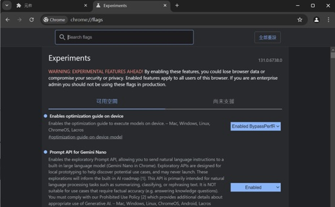
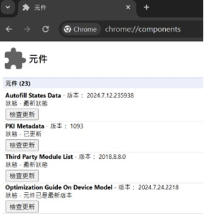
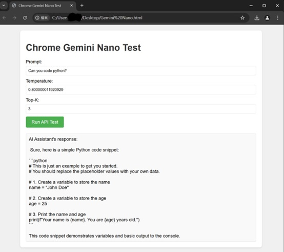

# How to Run Gemini Nano Locally???

Hi every, I am going to share how to use Google Chrome (Developer Version) to run Gemini Nano.

## Setup Steps:

1. Go to [Google Chrome Developer Tools](https://www.google.com/chrome/dev/) to download the Chrome Developer Version.
   
2. In the address bar, enter `chrome://flags`, search for `prompt-api-for-gemini-nano`, and set it to **Enabled**.

3. Similarly, search for `optimization-guide-on-device-model` in `chrome://flags` and set it to **Enabled BypassPerfRequirement**.

   

4. Relaunch Chrome.

5. Go to `chrome://components` and check if the `Optimization Guide On Device Model` version is greater than or equal to `2024.5.21.1031`.

   

6. Press **F12** to open DevTools and enter the following command in the console:

   (await ai.assistant.capabilities()).available;

   If this returns **“readily”**, then you are all set.

7. Download `Gemini_Nano_test.html` to your PC. Open it with the Chrome Developer Version and enter your prompt.

   

Now you can run Gemini Nano locally!
